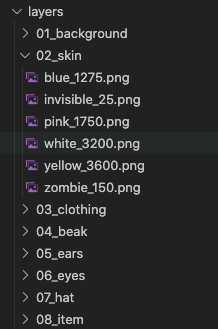

🦆 [Website](https://secretducksociety.com) 🦆 [Twitter](https://twitter.com/secretducknft) 🦆 [Discord](https://discord.gg/a7nVsdsv5Q) 🦆

# NFTCollectionGenerator

### Prerequisites
You must download some prerequisite software to be able to run this code:
- [Node](https://nodejs.org/en/download/)
- [Git](https://github.com/git-guides/install-git)
- [Yarn](https://classic.yarnpkg.com/lang/en/docs/install/#mac-stable)


### Installation
```
git clone https://github.com/SecretDuckSociety/NFTCollectionGenerator.git
yarn install
```

### How to generate your NFTs

**Step 1**: Add your layers and assets to the layers directory.
- The layers directory should contain a list of directories, each representing a layer in your NFT. In each layer, add your asset png files and assign them rarity by appending to the file name '_N' where N is the rarity weight you want to give the particular asset. Rarities are done by weight in each layer folder need not add to 100.

Example:



**Step 2**: Set your image size
- Open the src/settings.js file. Find the variable named `dimensions` and edit the width and height values to change the desired size in pixels of your generated images.

**Step 3**: Add your metadata
- Your exact metadata format will depend on the chain you are releasing on. For Solana projects, as in the example in this repo, the metadata should follow the [metaplex metadata standard](https://medium.com/metaplex/metaplex-metadata-standard-45af3d04b541). Open the src/main.js file. Find the function named `saveImageMetadata`. Update the variable `imageMetadata` with the format and values specific to your project.

**Step 4**: Generate your images
- Generating the images is now as easy as running one simple command:
- `node index [NUM_IMAGES]`, where NUM_IMAGES is the number of NFTs you want to generate
- Ex: `node index 500`
- An output folder will be created with two subfolders. The first, 'images', will contain all your created images. The second, 'metadata', will contain a corresponding json metadata file for each created image. It will also contain a file 'metadata.json' which will contain the full set of metadata for your entire collection in one file.

**Step 5 (optional)**: Analyze your output
- You can analyze your ouput to find the exact rarities of each trait and search for images with specific traits.
- Run `node analyze [NUM_TOP_RARES]` to analyze the rarity percentages of each trait. The output will be spit out in a file called 'probability-analysis.json'. The analysis will also list the top rarest NFTs generated. NUM_TOP_RARES is an optional argument to specify the number of top rares to list
- You can also search for specific NFT images with specific traits. 
- Run `node search [TRAIT:VALUE ...]` to list all the images with VALUE for the given TRAIT. Multiple traits and values can be specified.
- Ex: `node search skin:blue eyes:normal`
